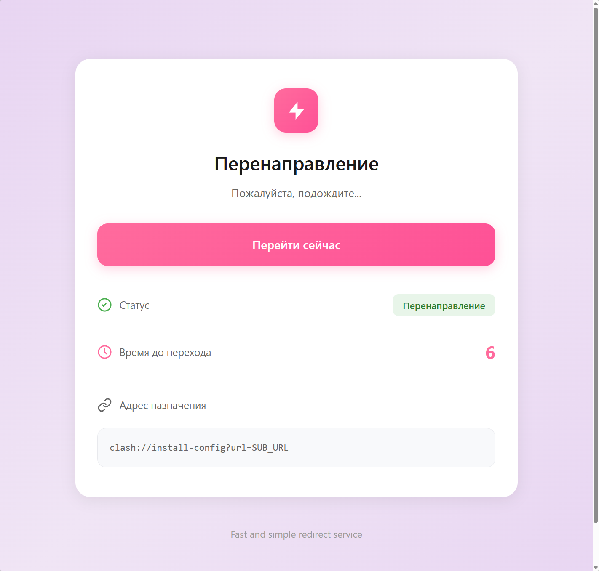
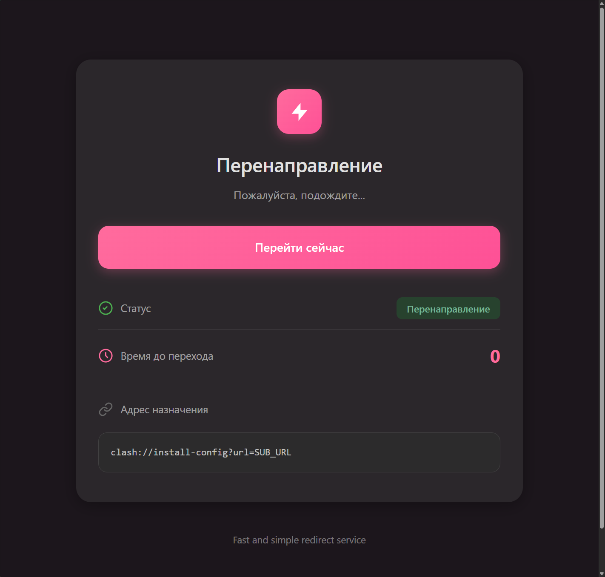

# ➡️ Страница перенаправления

Простая страница перенаправления, которая позволяет перенаправлять пользователей на другие URL-адреса с задержкой.

### 🧠 Что это такое?

Telegram Desktop на Windows некорректно открывает **внешние глубокие ссылки** (такие как `v2box://`, `happ://`, `clash://...` и т.д.), когда они приходят из браузера или сообщения.

## Использование

Добавьте параметр `redirect_to` к URL страницы:

https://sawgod.github.io/redirect-page/?redirect_to=clash://install-config?url=SUB_URL

## Особенности

- ⏱️ Автоматическое перенаправление через 7 секунд
- 🔄 Кнопка для немедленного перенаправления
- 📱 Адаптивный дизайн (мобильные устройства и десктоп)
- 🌐 Автоматическое определение языка (русский/английский)
- 🌙 Поддержка темной темы
- 🔗 Отображение URL назначения

## Превью

  
Превью тем

  
  

  

---
## 🔧 How to customize

Вы можете адаптировать эту страницу для своего проекта:

1. Измените HTML/CSS по своему усмотрению.
2. Разместите где угодно — GitHub Pages, Vercel, ваш сервер и т.д.

P.S. Особая благодарность https://github.com/sm1ky за предоставленное решение

